# Platform Healing: Getting Started

Platform Healing turns redacted exception telemetry into governed remediation work. It durably accepts eligible signals, deduplicates them into incidents, attributes an incident to an approved component and source repository, asks an isolated repair workflow for a bounded proposal, and lets Platform publish and verify the result under workspace-owned policy.

Healing is not an unattended production deployment system. GitHub and branch protection remain the source-control authority, the deployment system remains the rollout and rollback authority, and an incident is healed only after the repaired revision is deployed and positively verified in every affected environment.

For the threat model and incident-response procedures, see [Healing Security and Operations](security.md). The feature acceptance scenarios are in the [self-healing quickstart](../../specs/039-platform-self-healing/quickstart.md).

## How the Pieces Fit

```mermaid
flowchart LR
    A["Application OTLP signals"] --> B["Platform OpenTelemetry module"]
    B --> C["Redaction and durable Healing inbox"]
    C --> D["Classification, deduplication, and attribution"]
    D --> E["GitHub issue and approved repair workflow"]
    E --> F["Bounded proposal and trusted publisher"]
    F --> G["Pull request and merge policy"]
    G --> H["External deployment observation"]
    H --> I["Per-environment verification"]
```



The application sends telemetry; it does not choose a repository, workflow, branch, path policy, evidence policy, or merge policy. Those authorities live in Elsa Platform and are scoped to a workspace and application.

## Prerequisites

Before enabling discovery:

- Run Elsa Platform with the Healing module and the Foundation OpenTelemetry integration included by the API host.
- Configure a production relational database for the Healing context. SQLite is suitable for local development and single-process tests; use SQL Server for production scale-out.
- Give operators only the Healing permissions they need. Workspace owners receive all Healing permissions by default.
- Configure authenticated OTLP delivery for each monitored application/environment. Do not enable unauthenticated loopback outside isolated local development.
- Generate and register a component manifest for every application revision that may be repaired.
- Install the Platform GitHub App only on repositories that may be inspected or repaired.
- Add and approve the repository repair workflow at an immutable workflow revision.
- Ensure the deployment system can submit idempotent deployment observations.

The interactive API uses these permissions:

| Permission | Capability |
| --- | --- |
| `healing.read` | View safe incidents, configuration, audit, and usage. |
| `healing.configure` | Configure applications, environments, manifests, providers, ownership, and emergency stops. |
| `healing.incident.report` | Submit an already-redacted explicit incident for one route-scoped application/environment. |
| `healing.deployment.report` | Submit a trusted deployment observation for one route-scoped application/environment. |
| `healing.evidence.elevate` | Request additional protected evidence through an audited decision. |
| `healing.repair.retry` | Retry an eligible stopped or failed repair. |
| `healing.repair.stop` | Stop repair activity for an incident. |
| `healing.verification.waive` | Waive one environment's verification with reason and confirmation. |
| `healing.automerge.configure` | Change automatic-merge policy with target-bound confirmation. |

## 1. Configure the Platform Host

Start with discovery and review enabled while workers, repair dispatch, and automatic merge remain disabled:

```json
{
  "ConnectionStrings": {
    "Healing": "<provider-managed-connection-string>"
  },
  "Healing": {
    "PlatformKillSwitch": false,
    "DiscoveryEnabled": true,
    "IncidentReviewEnabled": true,
    "RepairDispatchEnabled": false,
    "AutomaticMergeEnabled": false,
    "VerificationEnabled": true,
    "Workers": {
      "Enabled": false
    },
    "Database": {
      "Provider": "SqlServer"
    },
    "OpenTelemetry": {
      "HttpEndpointPath": "/elsa/otlp/v1",
      "MaxHttpRequestBodySize": 10485760,
      "AllowUnauthenticatedLoopback": false
    },
    "Budgets": {
      "TimeBudget": "00:30:00",
      "MaxConcurrentOperations": 4,
      "MaxInferenceUnits": 200000,
      "MaxRepositoryRuns": 2,
      "MaxRepairAttempts": 2
    },
    "GitHub": {
      "WorkloadAudience": "elsa-platform-healing",
      "PlatformBaseUrl": "https://platform.example.com",
      "CapabilityLifetime": "00:35:00",
      "AttemptLeaseLifetime": "00:10:00",
      "ProposalLifetime": "02:00:00"
    }
  }
}
```

Keep connection strings, GitHub App private keys, webhook secrets, and model-provider credentials in the deployment secret store. Platform configuration and Healing records contain credential references, not secret values. The Healing context uses its own migration history table even when it shares the physical database with other Platform contexts.

The built-in budget ceilings are four hours, 32 concurrent operations, 2,000,000 inference units, 10 repository runs, and two repair attempts. Application policy may lower these values but cannot exceed the platform ceilings.

When managed inference is used, configure `Healing:ManagedInference:Copilot` with a model and bounded turn duration. Resolve its GitHub token from the named environment variable or use an explicitly managed logged-in identity; never place a token in `appsettings.json`.

## 2. Register Telemetry Sources

Create a telemetry source for each trusted application/environment producer in the Healing configuration UI or under:

```text
/api/workspaces/{workspaceId}/healing/applications/{applicationId}/telemetry-sources
```

Use the returned credential only in the emitting host's secret configuration. Rotation creates a replacement credential; revoke the previous credential after all emitters have switched. Verify the collector configuration endpoint before sending a test exception.

Healing accepts only the normalized exception profile after Platform redaction. Validation, authorization, cancellation, handled, and still-retrying failures are observation-only and do not automatically dispatch repairs. The durable inbox acknowledgement means the signal was accepted, not that it was classified as repairable.

### Optional application client

Most applications need only standard OpenTelemetry export. The `Elsa.Platform.Healing.Client` package is an optional convenience for applications that need to add the normalized Healing profile to an activity or explicitly report an already-redacted incident. It does not contain repository, workflow, branch, path, evidence, or merge authority.

Add profile attributes before recording the exception on the activity:

```csharp
activity.EnrichForHealing(new HealingTelemetryContext(
    applicationId,
    environmentId,
    "workflow.execute",
    HealingFailureClasses.UnexpectedWorkflow,
    HealingRetryStates.Exhausted,
    RevisionId: revisionId));
```

For explicit reporting, register the typed client with the same server-owned scope used by the telemetry source:

```csharp
services.AddElsaPlatformHealingClient(options =>
{
    options.PlatformBaseAddress = new Uri("https://platform.example.com/");
    options.WorkspaceId = workspaceId;
    options.ApplicationId = applicationId;
    options.EnvironmentId = environmentId;
});
```

Configure authentication on the underlying `HttpClient` through a deployment-managed handler. Call `IHealingClient.ReportIncidentAsync` only with `HealingEvidenceMetadata.IsRedacted=true`; the client rejects unredacted requests before transport. Supply a stable, non-secret idempotency key when retries may repeat the same report. Platform still derives tenant and application identity from the authenticated route and resolves all repair authority from its own configuration.

## 3. Register Revision Manifests

Generate a component manifest as part of the application build and register it for the exact application revision. A manifest may describe the application, packages, assemblies, hashes, dependency edges, and source metadata suggestions. It must not contain local source paths, credentials, or private package-feed secrets.

In Platform:

1. Upload the manifest for the revision.
2. Verify its attestation and content hashes.
3. Confirm that package and assembly identities match the deployed artifact.
4. Revoke a manifest if its provenance becomes untrusted.

Repository metadata in a manifest is a suggestion, not repair authority. A verified manifest without an active ownership binding remains observation-only.

## 4. Configure GitHub Authority and Checks

Create an authority profile for the installed GitHub App and repository. Store references to the App credential and webhook secret in the workspace credential store. Validate the provider connection before activating a source ownership binding.

Grant the GitHub App only the permissions required for enabled capabilities:

- Metadata: read.
- Issues: read/write.
- Actions: read/write for dispatching the approved workflow.
- Contents and pull requests: read/write for the trusted publisher only.
- Checks and statuses: read.
- Administration/branch protection: read when repository policy permits it.

Configure the App webhook to send to:

```text
POST /api/integrations/github/webhooks
```

Use a repository-specific webhook secret reference. Platform verifies `X-Hub-Signature-256`, installation and repository identity, allowed event/action pairs, and unique `X-GitHub-Delivery` before processing.

The repair workflow must:

- be selected by immutable identity and revision in the ownership binding;
- request a GitHub OIDC token with the configured `Healing:GitHub:WorkloadAudience`;
- exchange the signed token and one-time attempt nonce with Platform;
- use the resulting capability only to read one evidence bundle, heartbeat one lease, and submit one bounded proposal/result;
- never receive a GitHub installation token or direct repository mutation authority.

Set required check names in the merge policy exactly as GitHub reports them. Automatic merge fails closed if a required check, branch-protection snapshot, independent verifier, producing revision, reproduction result, regression evidence, path/size gate, or rollout-stop capability is missing, stale, ambiguous, unknown, or failed.

## 5. Choose Repairable Packages and Paths

An active source ownership binding is the allow-list for repair authority. Selectors can target an application, package, assembly, or exact component key and may use the supported glob pattern. For example, an Acme team can bind `Acme.*` packages to its repository while Elsa and third-party packages remain observation-only.

For every binding, configure:

- the immutable GitHub repository identity, target branch, workflow identity, workflow reference, and workflow revision;
- allowed source roots and forbidden roots;
- maximum files, changed lines, and patch bytes;
- whether reproduction is required or high-confidence inference may produce a draft PR;
- the minimum inference confidence and maximum evidence tier;
- required checks, forbidden change categories, an independent verifier, and rollout-stop/rollback requirements.

Use narrow package selectors and narrow allowed roots. The default authority profile allows `src` and `tests`, forbids `.github`, `.azure`, `eng`, and `scripts`, and caps a proposal at 20 files, 1,000 changed lines, and 1,000,000 patch bytes. Platform always rejects absolute/traversal paths, binary patches, symlinks, submodules, forbidden renames, and self-protection paths such as the Healing workflow, publisher/permission/validation policy, CODEOWNERS, or branch-protection automation.

Overlapping bindings are permitted only when they resolve to the same repair authority. Conflicting matches block automation until an owner resolves the ambiguity. Suspending or revoking a provider or binding prevents new publication and merge work for active attempts.

## 6. Enable in Stages

Enablement is the intersection of platform, workspace, application, and environment policy. A narrower scope can stop work but cannot override a broader stop.

Recommended progression:

1. **Observe:** keep `Healing:Workers:Enabled=false`, repair dispatch off, and automatic merge off. Validate storage, redaction, telemetry identity, and manifests.
2. **Triage:** enable workers with discovery on. Review deduplication, exclusions, attribution, impact, and budgets without repository mutation.
3. **Draft repairs:** enable platform and application repair dispatch for one non-production environment and one narrowly bound package. Keep automatic merge off.
4. **Human merge:** validate issue/workflow/PR idempotency, required checks, publisher restrictions, and deployment observations.
5. **Verification:** require positive affected-operation evidence and a recurrence-free window in each environment.
6. **Constrained auto-merge:** opt in only low-risk repositories after the security matrix and sandbox GitHub integration gate pass. Require target-bound confirmation and retain deployment rollback or rollout-stop authority outside Healing.

At the application level, configure discovery, repair dispatch, automatic merge, signal profile, default attempt limit, verification window, budgets, and per-environment overrides. Environment settings can disable discovery or repair, adjust occurrence threshold/debounce, or activate an environment kill switch.

## Day-Two Operations

### Triage an exception

1. Open **Operations → Healing** and filter by application, environment, severity, state, repairability, or time.
2. Confirm the occurrence was accepted after redaction and grouped under the expected fingerprint.
3. Review affected environments/revisions, classification reason, component attribution, binding, and repair blockers.
4. Treat missing or ambiguous authority as a configuration problem; do not route it by editing the GitHub issue.
5. Request elevated evidence only when the ordinary safe bundle is insufficient and the purpose is authorized.

### Review and merge a repair

Confirm the PR states whether the exception was reproduced, inferred without reproduction, or revision-unverified. Review the producing and target revisions, before/after evidence, validation results, changed paths, risk, rollback guidance, required checks, and every merge gate.

Unreproduced and revision-unverified repairs are draft and human-merge-only. A GitHub merge proves only that code changed; it does not heal the incident.

### Verify deployment

The deployment system posts an idempotent observation for the repaired revision and environment. Healing waits for both a positive affected-operation observation and no matching recurrence during the configured verification window. Environment states distinguish merged, deployed, deployed-unverified, healed, failed verification, superseded, and waived.

Keep the incident open until every active affected environment is healed, superseded, or explicitly waived. Healing emits a trusted verification-failed signal on recurrence but does not stop or roll back a deployment.

### Retry, stop, and waive

- Retry only after correcting the recorded blocker; the platform maximum remains two repair attempts.
- Stop is idempotent and prevents further incident repair orchestration without deleting evidence or audit history.
- Waive only one episode/environment at a time, with reason, expiry or terminal intent, and target-bound confirmation. A waiver is a governed closure decision, not positive verification.
- GitHub comments and labels are requests, not commands. Platform executes only normalized requests from a verified webhook actor linked to a Platform account with the required workspace permission and confirmation.

### Audit and usage

Use the Healing audit view or `GET /api/workspaces/{workspaceId}/healing/audit` to reconstruct configuration, classification, attribution, evidence access, provider, publication, merge, command, deployment, verification, and closure decisions. Ordinary audit responses contain safe structured metadata, not prompts, source code, raw exception payloads, or credentials.

Use `GET /api/workspaces/{workspaceId}/healing/usage` to review bounded attempt, duration, provider, repository-run, and inference-unit usage. Investigate budget exhaustion before increasing a limit.

## Kill Switches and Recovery

The platform, workspace, application, and environment kill switches take precedence over stage enablement. An application emergency stop requires a short-lived target-bound confirmation and blocks new repair dispatch, publication, and automatic merge while preserving telemetry, incidents, provider state, and audit history.

When stopping Healing:

1. Activate the narrowest switch that contains the risk; use `Healing:PlatformKillSwitch=true` for a platform-wide emergency.
2. Stop or suspend affected repair attempts, bindings, or provider connections.
3. Rotate or revoke compromised telemetry, webhook, App, or model credentials in the owning secret store.
4. Inspect the safe audit trail and external GitHub/deployment audit logs.
5. Correct redaction, authority, workflow, policy, or deployment-observation configuration.
6. Revalidate the provider connection and binding in a sandbox.
7. Resume with target-bound confirmation, then retry only the intended incidents.

Do not delete incidents or migration history as a recovery mechanism. See [Healing Security and Operations](security.md#incident-response-and-recovery) for compromise-specific actions.

## Current Limitations

- GitHub is the only v1 source-control provider.
- Healing consumes Platform's native post-redaction OTLP path; it does not poll arbitrary external log backends.
- Automatic repair requires a trusted revision manifest and one unambiguous active ownership binding. Unbound packages remain observation-only.
- Platform can publish a high-confidence inferred draft when policy permits, but lack of reproduction or a verified producing revision always prevents automatic merge.
- The repair agent receives bounded evidence and source context and has no arbitrary Platform, shell, deployment, or Git write authority.
- Platform observes deployment and verification state; it never deploys, stops a rollout, or rolls back.
- Evidence elevation is deny-by-default until an explicit host authorization policy is configured.
- Provider outages and worker delays may make projections stale. The last durable Platform state remains authoritative and retries are idempotent.

## Validation Checklist

Before production enablement, complete the deterministic scenarios in the [self-healing quickstart](../../specs/039-platform-self-healing/quickstart.md), including the security negative matrix and real GitHub sandbox gate. Also verify:

- secrets are absent from agent input, work items, PRs, ordinary audit, and logs;
- duplicate telemetry, webhook delivery, and provider retries do not create duplicate incidents, issues, branches, or PRs;
- each repairable package maps to exactly one approved repository authority;
- all auto-merge gates fail closed under missing, stale, or unknown evidence;
- emergency stop and confirmed resume work at the intended scope;
- deployment recurrence produces failed verification without invoking rollback;
- operators can reconstruct the complete decision chain from safe audit events.
